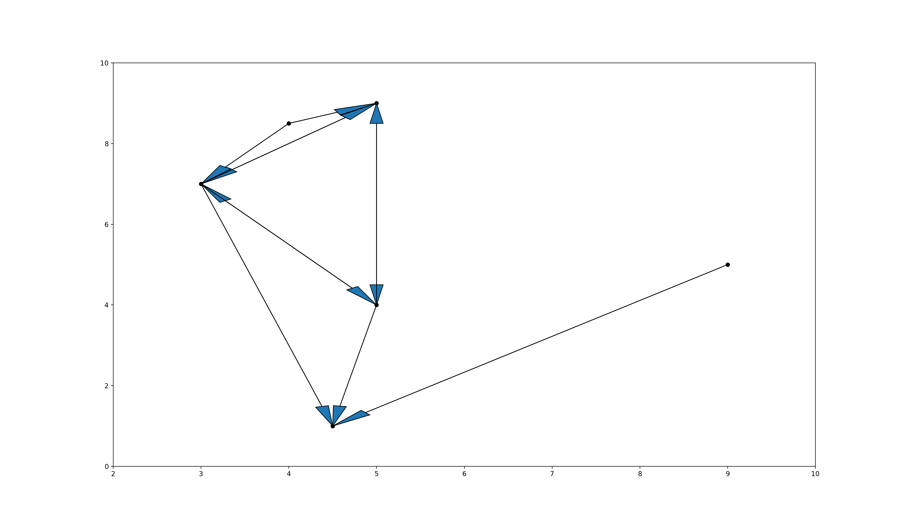
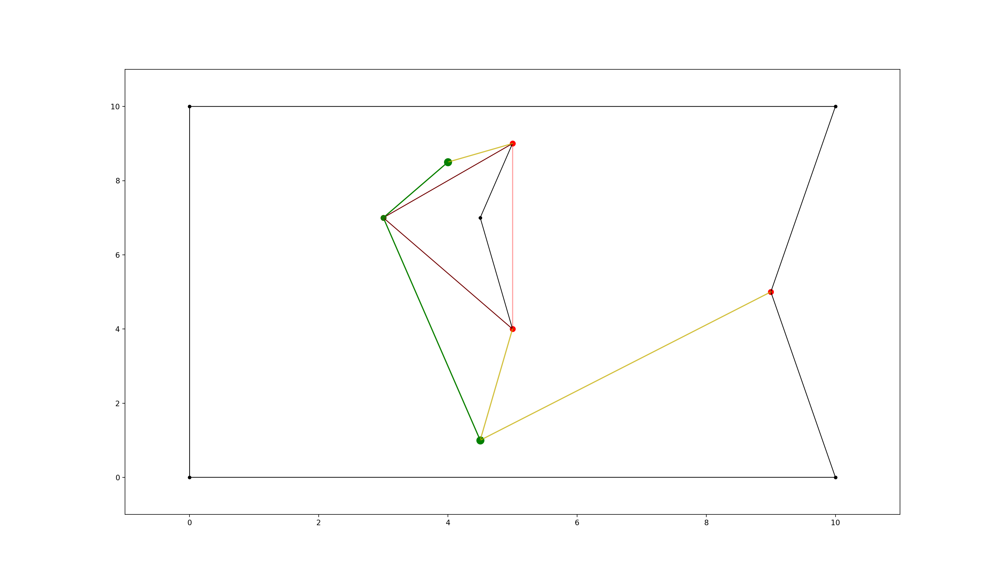

===================
extremitypathfinder
===================

.. image:: https://travis-ci.org/MrMinimal64/extremitypathfinder.svg?branch=master
    :target: https://travis-ci.org/MrMinimal64/extremitypathfinder

.. image:: https://img.shields.io/pypi/wheel/extremitypathfinder.svg
    :target: https://pypi.python.org/pypi/extremitypathfinder

.. image:: https://img.shields.io/pypi/v/extremitypathfinder.svg
    :target: https://pypi.python.org/pypi/extremitypathfinder

.. image:: https://anaconda.org/conda-forge/extremitypathfinderr/badges/version.svg
    :target: https://anaconda.org/conda-forge/extremitypathfinder

Python package for fast geometric shortest path computation for given 2D multi-polygon maps based on visibility.

.. image:: ./img/path_plot.png

Also see:
`GitHub <https://github.com/MrMinimal64/extremitypathfinder>`__,
`PyPI <https://pypi.python.org/pypi/extremitypathfinder/>`__,
`conda-forge feedstock <https://github.com/conda-forge/extremitypathfinder-feedstock>`__,

Dependencies
============

(``python3``),
``numpy``,
``matplotlib``,

Installation
============

Installation with conda: see instructions at `conda-forge feedstock <https://github.com/conda-forge/extremitypathfinder-feedstock>`__ (NOTE: The newest version of extremitypathfinder might not be available via conda yet)

Installation with pip:
in the command line:

::

    pip install extremitypathfinder

Usage
=====

code from ``example.py``:

::

    from extremitypathfinder import PolygonEnvironment
    environment = PolygonEnvironment()

Store environment:
__________________

**Required data format:**
Ensure that all the following conditions on the polygons are fulfilled:

- numpy or python array of coordinate tuples: ``[(x1,y1), (x2,y2,)...]``
- the first point is NOT repeated at the end
- must at least contain 3 vertices
- no consequent vertices with identical coordinates in the polygons (same coordinates in general are allowed)
- a polygon must not have self intersections (intersections with other polygons are allowed)
- edge numbering has to follow this convention (for easier computations):
    - outer boundary polygon: counter clockwise
    - holes: clockwise

::

    # counter clockwise vertex numbering!
    boundary_coordinates = [(0.0, 0.0), (10.0, 0.0), (9.0, 5.0), (10.0, 10.0), (0.0, 10.0)]

    # clockwise numbering!
    list_of_holes = [[(3.0, 7.0), (5.0, 9.0), (4.5, 7.0), (5.0, 4.0), ], ]
    environment.store(boundary_coordinates, list_of_holes, validate=True, export_plots=False)

BETA: Pass ``validate=True`` to ``.store()`` in order to check those condition.
Pass ``export_plots=True`` in order to generate and store plots with matplotlib.

**Note:** As mentioned in `[1, Ch. III 6.3] <http://www.cs.au.dk/~gerth/advising/thesis/anders-strand-holm-vinther_magnus-strand-holm-vinther.pdf>`__ in 'chessboard-like grid worlds' it can be better to use A* right away (-> implemented in ``graph_search.py``).

Preprocessing:
______________

::

    map.prepare(export_plots=False)

Query:
______

::

    start_coordinates = (4.5, 1.0)
    goal_coordinates = (4.0, -1908.5)
    path, length = environment.find_shortest_path(start_coordinates, goal_coordinates, export_plots=False)

Plotting:
_________

TODO

Storing and Loading Environment:
______________________________________________

::

    environment.export_pickle(path='./pickle_file.pickle')

    from extremitypathfinder import load_pickle
    environment = load_pickle(path='./pickle_file.pickle')

Basic Idea
==========

TODO map plot

Well described in `[1, Ch. II 3.2] <http://www.cs.au.dk/~gerth/advising/thesis/anders-strand-holm-vinther_magnus-strand-holm-vinther.pdf>`__:

An map/environment/world of a given shortest path problem can be represented by one boundary polygon with holes (themselves polygons).

IDEA: Two categories of vertices/corners can be distinguished in polygons:

* protruding corners (hereafter called **"Extremities"**, marked in red)
* all others

Extremities have an inner angle (facing towards the inside of the map) of > 180 degree.
As long as there are no obstacles between two points present, it is obviously always best (=shortest) to move to the goal point directly.
When obstacles obstruct the direct path (goal is not directly 'visible' from the start) however, extremities (and only extremities!) have to be visited until the goal is directly visible.

*Improvement:* As described in `[1, Ch. II 4.4.2 "Property One"] <http://www.cs.au.dk/~gerth/advising/thesis/anders-strand-holm-vinther_magnus-strand-holm-vinther.pdf>`__ during preprocessing time the visibility graph can be reduced further without the loss of guaranteed optimality of the algorithm:
Starting from any point lying "in front of" an extremity ``e``, such that both adjacent edges are visible, one will never visit ``e``, because everything is reachable on a shorter path without ``e`` (except ``e`` itself). An extremity ``e1`` lying in the area "in front of"
extremity ``e`` hence is never the next vertex in a shortest path coming from ``e``. And also in reverse: when coming from ``e1`` everything else than ``e`` itself can be reached faster without visiting ``e1``. -> ``e`` and ``e1`` do not have to be connected in the graph.

Algorithm
=========

This package pretty much implements the Visibility Graph Optimized (VGO) Algorithm described in `[1, Ch. II 4.4.2] <http://www.cs.au.dk/~gerth/advising/thesis/anders-strand-holm-vinther_magnus-strand-holm-vinther.pdf>`__, just with a few computational tweaks:

Rough Procedure:
________________

- **1. Preprocessing the map:** Independently of any query start and goal points the optimized visibility graph is being computed for the static environment once with ``map.prepare()``. Later versions might include a faster approach to compute visibility on the fly, for use cases where the map is changing dynamically

.. image:: ./img/prepared_map_plot.png

- **2. Including start and goal:** The start and goal points are being connected to the graph depending on their visibility. Notice that the added edges are directed:

- **3. A-star shortest path computation :** Finding the shortest path on graphs is a well known problem. Use a version of the popular ``A*-Algorithm`` optimized for this special use case.

Tweaks (my contribution):
_________________________

**Visibility detection:**
To my knowledge the was no previous algorithm for computing the visibility of points that is visiting edges at most once without any intersection, distance or trigonometric computations and without sorting.

todo explain angle representation
todo explain algorithm

todo link other algorithms

**Modifications to A-star:** The basic algorithm has been modified to exploit the following geometrical property of this specific task (and hence also the extracted graph):
it is always shortest to directly reach a node instead of visiting other nodes first
(there is never an advantage through reduced edge weight).

This can be exploited in a lot of cases to make a* terminate earlier than for general graphs:

- when the goal is directly reachable, there can be no other shorter path to it. Terminate.

- when always only expanding the nodes with the lowest estimated cost (lower bound), there is no need to revisit nodes (path only gets longer)

**Laziness:** I will write this later...

Comparison to pyvisgraph
========================

todo link

Pros:
- in theory computationally superior procedure

Cons:

- so far some missing features
- new package, might contain bugs
- no existing speed comparison

Contact
=======

Most certainly there is stuff I missed, things I could have optimized even further or explained more clearly, etc. I would be really glad to get some feedback on my code.

If you encounter any bugs, have suggestions, criticism, etc.
feel free to **open an Issue**, **add a Pull Requests** on Git or ...

contact me: *[python] {*-at-*} [michelfe] {-*dot*-} [it]*

License
=======

``extremitypathfinder`` is distributed under the terms of the MIT license
(see LICENSE.txt).

References
==========

[1] Vinther, Anders Strand-Holm, Magnus Strand-Holm Vinther, and Peyman Afshani. `"Pathfinding in Two-dimensional Worlds" <http://www.cs.au.dk/~gerth/advising/thesis/anders-strand-holm-vinther_magnus-strand-holm-vinther.pdf>`__. no. June (2015).