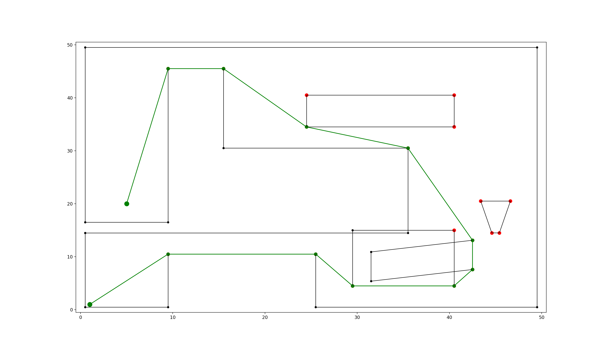

===================
extremitypathfinder
===================

..
    Note: can't include the badges file from the docs here, as it won't render on PyPI -> sync manually

.. image:: https://github.com/jannikmi/extremitypathfinder/actions/workflows/build.yml/badge.svg?branch=master
    :target: https://github.com/jannikmi/extremitypathfinder/actions?query=branch%3Amaster

.. image:: https://readthedocs.org/projects/extremitypathfinder/badge/?version=latest
    :alt: documentation status
    :target: https://extremitypathfinder.readthedocs.io/en/latest/?badge=latest

.. image:: https://img.shields.io/pypi/wheel/extremitypathfinder.svg
    :target: https://pypi.python.org/pypi/extremitypathfinder

.. image:: https://img.shields.io/badge/pre--commit-enabled-brightgreen?logo=pre-commit&logoColor=white
   :target: https://github.com/pre-commit/pre-commit
   :alt: pre-commit

.. image:: https://pepy.tech/badge/extremitypathfinder
    :alt: Total PyPI downloads
    :target: https://pepy.tech/project/extremitypathfinder

.. image:: https://img.shields.io/pypi/v/extremitypathfinder.svg
    :alt: latest version on PyPI
    :target: https://pypi.python.org/pypi/extremitypathfinder

.. image:: https://img.shields.io/badge/code%20style-black-000000.svg
    :target: https://github.com/psf/black

python package for fast geometric shortest path computation in 2D multi-polygon or grid environments based on visibility graphs.

Supported versions
------------------

Python >=3.12,<4 is accepted; CI currently tests CPython 3.12–3.14.
Dependencies are NetworkX 3.x and NumPy >=2.2,<3
(NumPy >=2.3.3 on Python 3.14). Python <3.12 and NumPy 1.x, 2.0 and 2.1
are no longer supported.

The Python and NumPy floors follow the September 2026 downstream support
window in `NEP 29 <https://numpy.org/neps/nep-0029-deprecation_policy>`__,
now superseded by `SPEC 0 <https://scientific-python.org/specs/spec-0000/>`__.
Both policies exclude Python 3.11 by this date. This compatibility window is
narrower than CPython's security support lifetime. Review the floors for future
releases; SPEC 0 recommends dropping Python 3.12 in October 2026.
These recommendations do not promise upstream bug fixes for every included
NumPy release.
CI runs the full suite with minimum and latest compatible dependencies,
both with and without the ``numba`` extra, on every supported Python version.

The optional ``numba`` extra installs Numba >=0.61.2 and SciPy >=1.14.1
(Numba >=0.63 and SciPy >=1.16.1 on Python 3.14). SciPy supplies the compiled
linear algebra routines. Pip selects compatible versions; Numba may constrain
NumPy more tightly than the ordinary installation.
Acceleration depends on Numba/llvmlite platform support and adds installation
size and initial compilation time. Standard, GIL-enabled CPython is tested;
free-threaded builds and alternative interpreters are not covered by CI.

Quick Guide:

Install the package with the optional Numba extra for a significant speedup:

.. code-block:: console

    pip install "extremitypathfinder[numba]"

.. code-block:: python

    from extremitypathfinder import PolygonEnvironment

    environment = PolygonEnvironment()
    # counter clockwise vertex numbering!
    boundary_coordinates = [(0.0, 0.0), (10.0, 0.0), (9.0, 5.0), (10.0, 10.0), (0.0, 10.0)]
    # clockwise numbering!
    list_of_holes = [
        [
            (3.0, 7.0),
            (5.0, 9.0),
            (4.5, 7.0),
            (5.0, 4.0),
        ],
    ]
    environment.store(boundary_coordinates, list_of_holes, validate=False)
    start_coordinates = (4.5, 1.0)
    goal_coordinates = (4.0, 8.5)
    path, length = environment.find_shortest_path(start_coordinates, goal_coordinates)

For more refer to the `documentation <https://extremitypathfinder.readthedocs.io/en/latest/>`__.

Also see:
`GitHub <https://github.com/jannikmi/extremitypathfinder>`__,
`PyPI <https://pypi.python.org/pypi/extremitypathfinder/>`__
