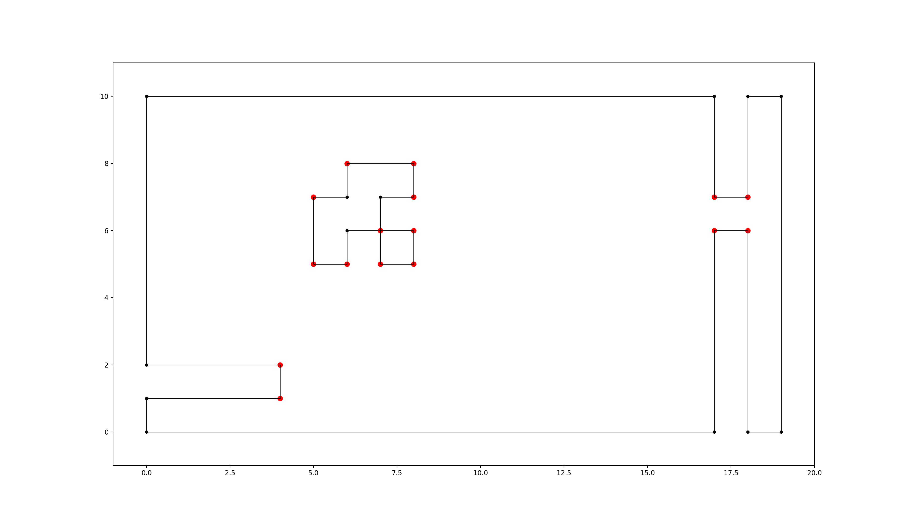

.. _usage:

=====
Usage
=====

.. note::

   Also check out the :ref:`API documentation <api>` or the `code <https://github.com/MrMinimal64/extremitypathfinder>`__.

.. _init:

Initialisation
--------------

Create a new instance of the :ref:`PolygonEnvironment class <env>` to allow fast consequent timezone queries:

.. code-block:: python

    from extremitypathfinder import PolygonEnvironment
    environment = PolygonEnvironment()

Store environment:
__________________

**Required data format:**
Ensure that all the following conditions on the polygons are fulfilled:

- numpy or python array of coordinate tuples: ``[(x1,y1), (x2,y2,)...]``
- the first point is NOT repeated at the end
- must at least contain 3 vertices
- no consequent vertices with identical coordinates in the polygons (same coordinates in general are allowed)
- a polygon must not have self intersections
- polygons must not intersect each other
- edge numbering has to follow this convention (for easier computations):
    - outer boundary polygon: counter clockwise
    - holes: clockwise

.. code-block:: python

    # counter clockwise vertex numbering!
    boundary_coordinates = [(0.0, 0.0), (10.0, 0.0), (9.0, 5.0), (10.0, 10.0), (0.0, 10.0)]

    # clockwise numbering!
    list_of_holes = [[(3.0, 7.0), (5.0, 9.0), (4.5, 7.0), (5.0, 4.0), ], ]
    environment.store(boundary_coordinates, list_of_holes, validate=False)

**BETA**: Pass ``validate=True`` in order to check the condition on the data.

**NOTE**: If two Polygons have vertices with identical coordinates (this is allowed), paths through these vertices are theoretically possible!
When the paths should be blocked, use a single polygon with multiple identical vertices instead (also allowed).

.. TODO visualisation plot

Preprocessing:
______________

computes the :ref:`visibility graph  <algorithm>` of the environment once.

::

    environment.prepare()

Query:
______

.. code-block:: python

    start_coordinates = (4.5, 1.0)
    goal_coordinates = (4.0, 8.5)
    path, length = environment.find_shortest_path(start_coordinates, goal_coordinates)

If any start and goal point should be accepted without checking if they lie within the map, set ``verify=False``.
This is required if points lie really close to polygon edges and
"point in polygon" algorithms might return an unexpected result due to rounding errors.

.. code-block:: python

    path, length = environment.find_shortest_path(start_coordinates, goal_coordinates, verify=False)

Converting and storing a grid world:
____________________________________

.. code-block:: python

    size_x, size_y = 19, 10
    obstacle_iter = [# (x,y),
        # obstacles changing boundary
        (0, 1),
        (1, 1),
        (2, 1),
        (3, 1),

        (17, 9),
        (17, 8),
        (17, 7),

        (17, 5),
        (17, 4),
        (17, 3),
        (17, 2),
        (17, 1),
        (17, 0),

        # hole 1
        (5, 5),
        (5, 6),
        (6, 6),
        (6, 7),
        (7, 7),

        # hole 2
        (7, 5),
    ]
    environment.store_grid_world(size_x, size_y, obstacle_iter, simplify=False, validate=False)

    grid-like environment converted to a polygon environment with "extremities" marked in red

**Note:** As mentioned in
`[1, Ch. III 6.3] <http://www.cs.au.dk/~gerth/advising/thesis/anders-strand-holm-vinther_magnus-strand-holm-vinther.pdf>`__
in "chessboard-like grid worlds" (many small obstacles have a lot of extremities!)
it can be better to use A* right away (implemented in ``graph_search.py``).

Cache and import the environment:
__________________________________

.. code-block:: python

    environment.export_pickle(path='./pickle_file.pickle')

    from extremitypathfinder import load_pickle
    environment = load_pickle(path='./pickle_file.pickle')

Plotting:
_________

Check the code in ``plotting.py``.

