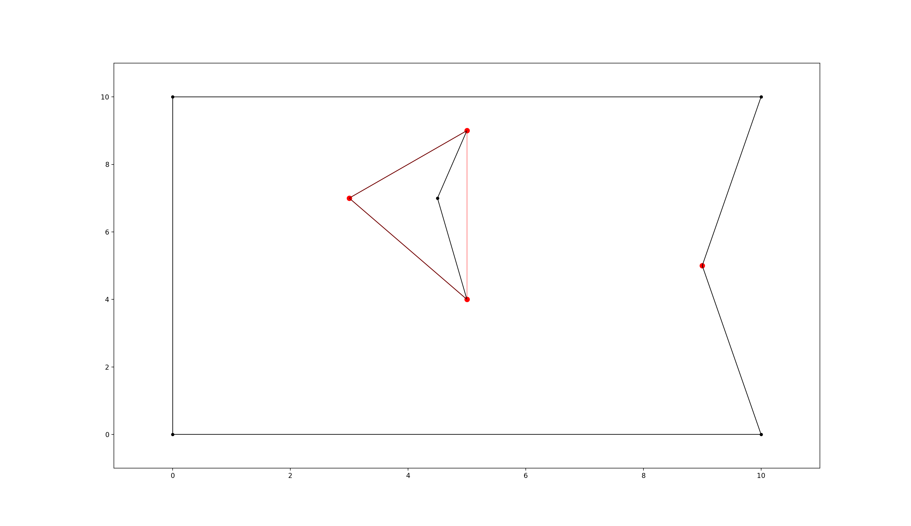
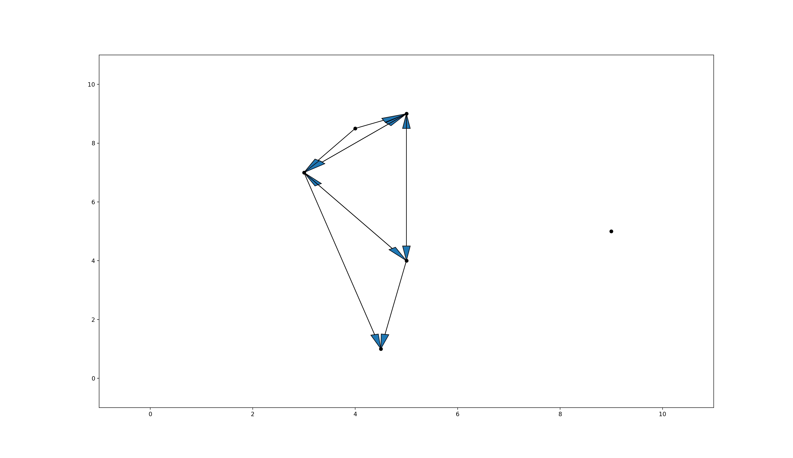

=====
About
=====

.. image:: https://api.travis-ci.org/MrMinimal64/extremitypathfinder.svg?branch=master
    :target: https://travis-ci.org/MrMinimal64/extremitypathfinder

.. image:: https://readthedocs.org/projects/extremitypathfinder/badge/?version=latest
    :alt: documentation status
    :target: https://extremitypathfinder.readthedocs.io/en/latest/?badge=latest

.. image:: https://img.shields.io/pypi/wheel/extremitypathfinder.svg
    :target: https://pypi.python.org/pypi/extremitypathfinder

.. image:: https://img.shields.io/badge/pre--commit-enabled-brightgreen?logo=pre-commit&logoColor=white
   :target: https://github.com/pre-commit/pre-commit
   :alt: pre-commit

.. image:: https://pepy.tech/badge/extremitypathfinder
    :alt: Total PyPI downloads
    :target: https://pepy.tech/project/extremitypathfinder

.. image:: https://img.shields.io/pypi/v/extremitypathfinder.svg
    :alt: latest version on PyPI
    :target: https://pypi.python.org/pypi/extremitypathfinder

.. image:: https://img.shields.io/badge/code%20style-black-000000.svg
    :target: https://github.com/psf/black

python package for fast geometric shortest path computation in 2D multi-polygon or grid environments based on visibility graphs.

.. image:: _static/title_demo_plot.png

Also see:
`GitHub <https://github.com/MrMinimal64/extremitypathfinder>`__,
`PyPI <https://pypi.python.org/pypi/extremitypathfinder/>`__

License
-------

``extremitypathfinder`` is distributed under the terms of the MIT license
(see `LICENSE <https://github.com/MrMinimal64/extremitypathfinder/blob/master/LICENSE>`__).

Basic Idea
----------------

Well described in `[1, Ch. II 3.2] <http://www.cs.au.dk/~gerth/advising/thesis/anders-strand-holm-vinther_magnus-strand-holm-vinther.pdf>`__:

An environment ("world", "map") of a given shortest path problem can be represented by one boundary polygon with holes (themselves polygons).

**IDEA**: Two categories of vertices/corners can be distinguished in these kind of environments:

* protruding corners (hereafter called **"Extremities"**)
* all others

.. figure:: _static/map_plot.png

    polygon environment with extremities marked in red

Extremities have an inner angle (facing towards the inside of the environment) of > 180 degree.
As long as there are no obstacles between two points present, it is obviously always best (=shortest) to move to the goal point directly.
When obstacles obstruct the direct path (goal is not directly 'visible' from the start) however, extremities (and only extremities!) have to be visited to reach the areas "behind" them until the goal is directly visible.

**Improvement:** As described in `[1, Ch. II 4.4.2 "Property One"] <http://www.cs.au.dk/~gerth/advising/thesis/anders-strand-holm-vinther_magnus-strand-holm-vinther.pdf>`__ during preprocessing time the visibility graph can be reduced further without the loss of guaranteed optimality of the algorithm:
Starting from any point lying "in front of" an extremity ``e``, such that both adjacent edges are visible, one will never visit ``e``, because everything is reachable on a shorter path without ``e`` (except ``e`` itself). An extremity ``e1`` lying in the area "in front of"
extremity ``e`` hence is never the next vertex in a shortest path coming from ``e``. And also in reverse: when coming from ``e1`` everything else than ``e`` itself can be reached faster without visiting ``e1``. -> ``e`` and ``e1`` do not have to be connected in the graph.

.. _algorithm:

Algorithm
=========

This package pretty much implements the Visibility Graph Optimized (VGO) Algorithm described in `[1, Ch. II 4.4.2] <http://www.cs.au.dk/~gerth/advising/thesis/anders-strand-holm-vinther_magnus-strand-holm-vinther.pdf>`__, just with a few computational tweaks:

Rough Procedure:
________________

- **1. Preprocessing the environment:** Independently of any query start and goal points the optimized visibility graph is being computed for the static environment once with ``map.prepare()``. Later versions might include a faster approach to compute visibility on the fly, for use cases where the environment is changing dynamically. The edges of the precomputed graph between the extremities are shown in red in the following plots. Notice that the extremity on the right is not connected to any other extremity due to the above mentioned optimisation:

    polygon environment with optimised visibility graph overlay in red

- **2. Including start and goal:** For each shortest path query the start and goal points are being connected to the internal graph depending on their visibility. Notice that the added edges are directed and also here the optimisation is being used to reduce the amount of edges:

    optimised directed heuristic graph for shortest path computation with added start and goal nodes

- **3. A-star shortest path computation :** Finding the shortest path on graphs is a standard computer science problem. This package uses a modified version of the popular ``A*-Algorithm`` optimized for this special use case.

.. figure:: _static/graph_path_plot.png

    polygon environment with optimised visibility graph overlay. visualised edges added to the visibility graph in yellow, found shortest path in green.

Tweaks (my contribution):
_________________________

Visibility detection: my "Angle Range Elimination Algorithm" (AREA)
********************************************************************

To the best of my knowledge there was no previous algorithm for computing the visibility of points (<-> visibility graph) that is visiting edges at most once without any trigonometric computations, without sorting and with that few distance/intersection checks.

Simple fundamental idea: points (extremities) are visible when there is no edge running in front "blocking the view".

Rough procedure: For all edges delete the points lying behind them. Points that remain at the end are visible.

In this use case we are not interested in the full visibility graph, but the visibility of just some points (extremities, start and goal). Additionally deciding if a point lies behind an edge can often be done without computing intersections by just comparing distances. This can be used to reduce the needed computations.

Further speed up can be accomplished by trying to prioritize closer edges, because they have a bigger chance to eliminate candidates.

The basic runtime complexity of this algorithm should be :math:`O(m^2 n)`, where :math:`m` is the amount of extremities (candidates) and :math:`n` is the amount of edges (= #vertices). This is fast, because of a few tweaks and usually :math:`m << n`.

Implemented in ``PolygonEnvironment.find_visible()`` in ``extremitypathfinder.py``

Comparison:
***********

**Lee's visibility graph algorithm**:

complexity: :math:`O(n^2 log_2 n)` (cf. `these slides <http://cs.smith.edu/~streinu/Teaching/Courses/274/Spring98/Projects/Philip/fp/algVisibility.html>`__)

- Initially all edges are being checked for intersection
- Necessarily checking the visibility of all points (instead of just some)
- Always checking all points in every run
- One intersection computation for most points (always when T is not empty)
- Sorting: all points according to degree on startup, edges in binary tree T
- Can work with just lines (not restricted to polygons)

**My Algorithm:**

- Checking all edges
- Not considering all points (just a few candidates)
- Decreasing number of candidates with every run (visibility is a symmetric relation -> only need to check once for every point pair!)
- Minimal intersection comp. (fraction of candidates)
- No sorting needed
- Could theoretically also work with just lines (this package however currently just allows polygons)
- More simple and clear approach

**Angle representation**: Instead of computing with angles in degree or radians, it is much more efficient and still sufficient to use a representation that is mapping an angle to a range :math:`a \in [0.0 ; 4.0[` (:math:`[0.0 ; 1.0[` in all 4 quadrants). This can be done without computationally expensive trigonometric functions!
Check the implementation in class ``AngleRepresentation`` in ``helper_classes.py``.

**Modifications to A-star:** The basic algorithm has been modified to exploit the following geometrical property of this specific task (and hence also the extracted graph):

    It is always shortest to directly reach a node instead of visiting other nodes first
    (there is never an advantage through reduced edge weight).

This can be exploited in a lot of cases to make A* terminate earlier than for general graphs:

- no need to revisit nodes (path only gets longer)

- when the goal is directly reachable, there can be no other shorter path to it -> terminate.

- not all neighbours of the current node have to be checked like in vanilla A* before continuing to the next node.

Implemented in ``graph_search.py``

**Laziness:** Angle representations of points are being computed only on demand.

Comparison to pyvisgraph
-------------------------

This package is similar to `pyvisgraph <https://github.com/TaipanRex/pyvisgraph>`__ which uses Lee's algorithm.

**Pros:**

- very reduced visibility graph (time and memory!)
- algorithms optimized for path finding
- possibility to convert and use grid worlds

**Cons:**

- parallel computing not supported so far
- no existing speed comparison

Contact
--------

Tell me if and how your are using this package. This encourages me to develop and test it further.

Most certainly there is stuff I missed, things I could have optimized even further or explained more clearly, etc.
I would be really glad to get some feedback.

If you encounter any bugs, have suggestions etc. do not hesitate to **open an Issue** or **add a Pull Requests** on Git.
Please refer to the :ref:`contribution guidelines <contributing>`

References
----------------

[1] Vinther, Anders Strand-Holm, Magnus Strand-Holm Vinther, and Peyman Afshani. `"Pathfinding in Two-dimensional Worlds" <http://www.cs.au.dk/~gerth/advising/thesis/anders-strand-holm-vinther_magnus-strand-holm-vinther.pdf>`__. no. June (2015).

Further Reading
----------------

Open source C++ library for 2D floating-point visibility algorithms, path planning: https://karlobermeyer.github.io/VisiLibity1/

Python binding of VisiLibity: https://github.com/tsaoyu/PyVisiLibity

Paper about Lee's algorithm: http://www.dav.ee/papers/Visibility_Graph_Algorithm.pdf

C implementation of Lee's algorithm: https://github.com/davetcoleman/visibility_graph

Acknowledgements
----------------

Thanks to:

`Georg Hess <https://github.com/georghess>`__ for improving the package in order to allow intersecting polygons.
`Ivan Doria <https://github.com/idoria75 >`__ for adding the command line interface.
